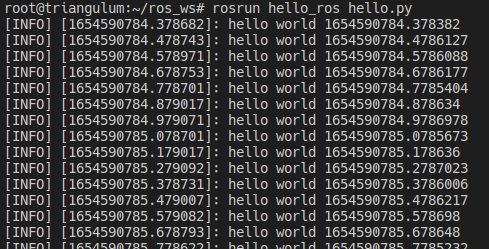

# ROS Hello Docker

Sample to publish hello world in ROS1 + Docker environment.

## Installing

---

- Docker
- Docker Compose

## Tests

---

Run the following command:

Terminal 1
```shell
cd ros_hello_docker
docker-compose up
```

Terminal 2
```shell
docker exec -it ros-work bash
rosrun hello_ros hello.py
```

## Results

---



